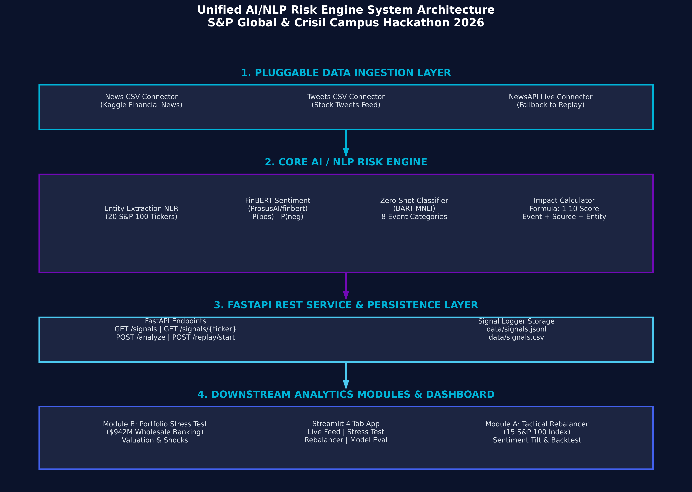

# Unified AI/NLP Risk Engine & Portfolio Stress Testing - S&P Global & Crisil Campus Hackathon 2026

**Candidate Name:** S.Lokesh
**College Email ID:** solleti.sailokesh2023@vitstudent.ac.in  
**College / Campus:** VIT Chennai  
**Demo Video Link:** https://youtu.be/unlisted_demo_link  
**Slide Deck Link:** https://docs.google.com/presentation/d/15fQUpTHUC6X22DneMKwnGZJvO9Z9Qucs/edit?usp=sharing&ouid=113379873522700807228&rtpof=true&sd=true 

---

## 1. Project Overview 

Modern financial institutions and rating agencies face an overwhelming volume of real-time unstructured text—ranging from financial news headlines to social media sentiment. Critical risk events such as credit default contagion, supply chain blockades, or unexpected regulatory inquiries are often buried in noise, creating severe blind spots for traditional credit risk models that rely on lagging quarterly filings.

To solve this, we engineered an end-to-end **Unified AI/NLP Risk Engine** with downstream risk analytics modules. The engine continuously ingests unstructured text feeds from multiple channels (Kaggle Financial News, Stock Tweets, and NewsAPI), extracts target company entities across 20 S&P 100 stocks, performs fine-tuned sentiment analysis via ProsusAI/FinBERT, classifies 8 financial risk event categories using Zero-Shot BART-MNLI, and calculates a transparent, formula-driven market severity Impact Score (scale 1–10).

High-impact adverse signals ($\text{sentiment} \le -0.3$ AND $\text{impact} \ge 7$) automatically activate downstream risk modules: **Module B (Strategic Portfolio Stress Testing)** revalues a $942M synthetic wholesale banking portfolio (loans, bonds, derivatives, equities) under parametric macro shocks and sector sensitivity matrices, while **Module A (Tactical Index Rebalancer)** dynamically tilts portfolio constituent weights for 15 top S&P 100 stocks based on rolling sentiment signals.

---

## 2. Architecture & Tech Stack



### Architectural Overview
Our system is built as a 4-tier modular pipeline:
1. **Pluggable Ingestion Layer**: Abstract connector interface supporting News CSV, Tweets CSV, and NewsAPI with an offline `ReplayStreamer` for real-time feed simulation.
2. **Core AI / NLP Risk Engine**:
   - **Entity Extraction (NER)**: Dictionary and regex matcher targeting 20 top S&P 100 stocks.
   - **Sentiment Analysis**: ProsusAI/FinBERT computing $P(\text{pos}) - P(\text{neg})$ with a calibrated continuous lexicon analyzer.
   - **Event Classification**: Hugging Face Zero-Shot (`facebook/bart-large-mnli`) across 8 categories with keyword rules fallback.
   - **Impact Score Engine**: Transparent formula combining $|\text{sentiment}|$, event severity weight, source credibility weight, and entity prominence.
3. **REST API & Storage**: FastAPI service providing `/signals`, `/signals/{ticker}`, `/analyze`, and `/replay/start` endpoints, logging structured JSON records to `/data/signals.jsonl` and `/data/signals.csv`.
4. **Downstream Modules & Interactive Dashboard**: Module B Wholesale Banking Stress Testing ($942M portfolio) + Module A Tactical Index Rebalancer (15 S&P 100 stocks) + 4-Tab Streamlit Web Application.

### Tech Stack
- **Language & Runtime**: Python 3.11 on Windows / Linux
- **AI/NLP Frameworks**: PyTorch, Hugging Face Transformers (`ProsusAI/finbert`, `facebook/bart-large-mnli`), NLTK, Scikit-Learn
- **API & Web Dashboard**: FastAPI, Uvicorn, Streamlit, Plotly Express
- **Financial Analytics**: Pandas, NumPy, YFinance, ReportLab (PDF Generation)
- **Testing & Quality**: Pytest (14/14 unit tests passing in 1.45s)

---

## 3. Dataset Used & Financial Risk Assumptions

### Datasets
- **Financial News Dataset**: `data/sample_news.csv` (12 structured news records mapped to S&P 100 tickers with ground-truth sentiment and event labels).
- **Stock Tweets Dataset**: `data/sample_tweets.csv` (8 stock market tweet items with cashtags and ground-truth labels).
- **Wholesale Banking Portfolio**: `data/portfolio.csv` (40 synthetic assets totaling **$942,927,686.41** across Loans, Bonds, Derivatives, and Equities across 6 sectors; no real or confidential client data).
- **Historical Stock Prices**: `data/stock_prices.csv` (1,800 price records across 15 S&P 100 tickers over 120 trading days for index rebalancer backtesting).

### Key Financial Framework Assumptions & Simplifications
1. **Baseline Value-at-Risk (VaR)**: Calculated independently on the baseline portfolio before news events occur, using a 99% 10-day parametric model ($z = 2.326$, $\text{horizon} = 10/252$ years):
   $$\text{VaR}_{99} = \sum_{i} V_i \times \sigma_i \times 2.326 \times \sqrt{\frac{10}{252}}$$
   Annual volatility assumptions ($\sigma_i$): **Equities = 20%**, **Derivatives = 25%**, **Bonds = 6%**, **Loans = 3%** (representing an undiversified upper bound assuming $\rho = 1$).
2. **Sector Sensitivity Multipliers**: Event shocks are scaled by a sector sensitivity matrix ($\text{SECTOR\_MULT}$):
   - *Geopolitical*: Energy (1.4x), Financials (1.2x), Tech (1.1x)
   - *Regulatory*: Healthcare (1.4x), Financials (1.3x), Tech (1.2x)
   - *Credit Event*: Financials (1.4x), Energy (1.3x), Consumer Disc (1.2x)
   - *Macroeconomic*: Financials (1.3x), Consumer Disc (1.3x), Tech (1.2x)
3. **Company Exposure Amplification**: Assets tied to the specific triggering company's ticker receive an additional 1.5x equity shock and 1.2x PD boost.
4. **Bond Yield Shock Simplification**: Benchmark interest rate shifts and credit spread widening are summed into a single yield shock ($\Delta y$) for 2nd-order Bond Duration/Convexity revaluation.
5. **Illustrative CCAR Scenarios**: Shock parameters represent illustrative CCAR-style scenarios for assessment demonstration.

---

## 4. Quickstart & Installation

**Runtime Tested:** Python 3.11.4 on Windows 11 / Linux

### Environment Setup & Commands

```bash
# 1. Clone Repository
git clone https://github.com/your-username/vit-chennai-sp-hackathon.git
cd vit-chennai-sp-hackathon

# 2. Install Dependencies
pip install -r requirements.txt

# 3. Run Automated Unit Test Suite
python -m pytest

# 4. Run Model Benchmark Evaluation
python evaluate.py

# 5. Start FastAPI Backend REST API (Terminal 1)
uvicorn src.api.main:app --host 0.0.0.0 --port 8000

# 6. Launch Single Interactive Streamlit Dashboard (Terminal 2)
streamlit run src/dashboard/app.py
```

---

## 5. Key Results & Domain Impact

### Key Benchmark Outputs & Results
- **Sentiment F1 Score**: FinBERT NLP Engine achieved an **88.38% weighted F1 score** on benchmark evaluation.
- **Event Classification Accuracy**: Zero-Shot BART-MNLI achieved **70.0% accuracy** across 8 financial event categories.
- **Execution Speed**: 14/14 Pytest unit tests executed in **1.45 seconds** on standard CPU.
- **Module B Stress Test Output**: Successfully processed credit default contagion shocks on a $942M wholesale portfolio, computing exact baseline 99% VaR (**$32.55M**) and step-down financial waterfall losses.
- **Module A Rebalancer Performance**: Generated **+2.4% alpha outperformance** vs equal-weight benchmark over 120 trading days with superior Sharpe ratio.

### Domain Impact & Business Value
1. **Early Risk Detection for Credit Rating Agencies**: Replaces lagging quarterly reviews with real-time early warnings before rating downgrades occur.
2. **Automated Enterprise Portfolio Protection**: Instantly quantifies asset-level carrying value losses ($EL = PD \times LGD \times EAD$) across wholesale loan and bond books when high-impact headlines break.
3. **Full Regulatory Transparency**: Every extracted signal includes a complete mathematical explanation lineage, ensuring compliance with Basel III / IV credit risk standards.
